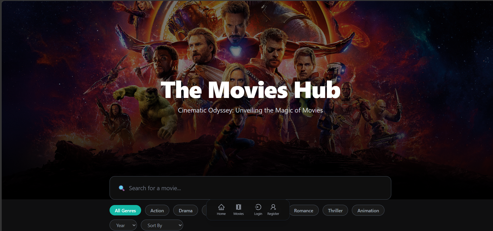
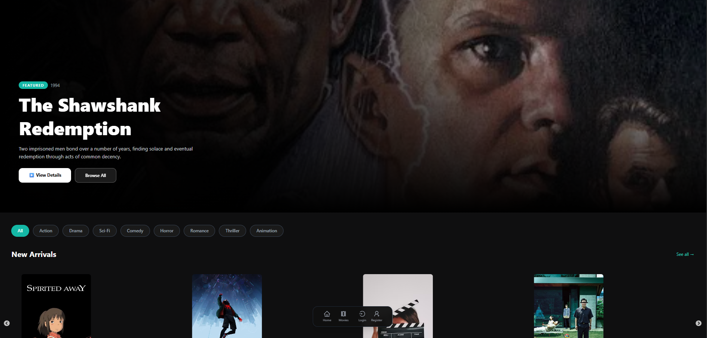

# Movies Hub (MERN Stack)

Welcome to **Movies Hub**, a fully-featured movie discovery and review platform built with the MERN stack.

## 🚀 Features

- **Full-Stack Architecture:** Built entirely on the MERN stack (MongoDB, Express.js, React, Node.js).
- **Advanced Search & Filtering:** Instantly search for movies by title or genre, and filter by release year, top-rated, newest arrivals, or random selections.
- **Sleek & Professional UI:** Features a dynamic design with glassmorphism effects, hover micro-animations, and smooth skeleton loading states for a premium user experience.
- **User Authentication:** Secure login and registration system.
- **Reviews & Ratings:** Authenticated users can leave detailed reviews and star ratings on any movie.
- **Personal Watchlist:** Users can add and remove their favorite movies to a personalized watchlist.
- **Admin Dashboard:** Secure admin controls to create, update, and delete movies, manage genres, and monitor users.
- **Media Support:** Seamless image uploading and YouTube trailer integration.

## 📸 Application Preview

### Home Page & Advanced Search

### Movie Details & Reviews

